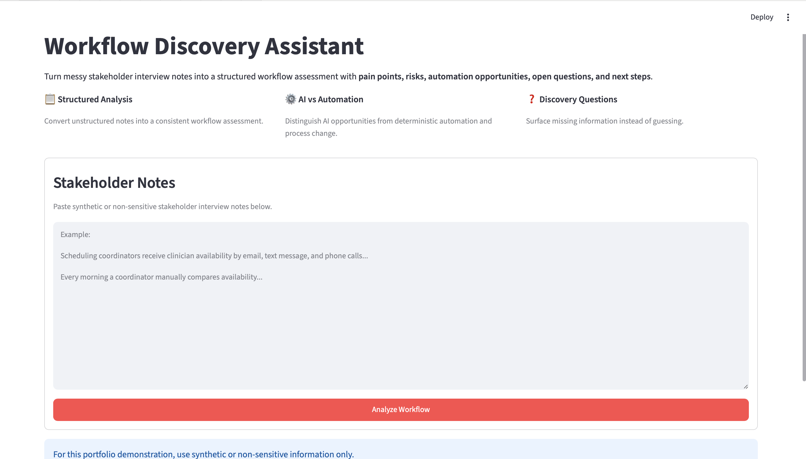
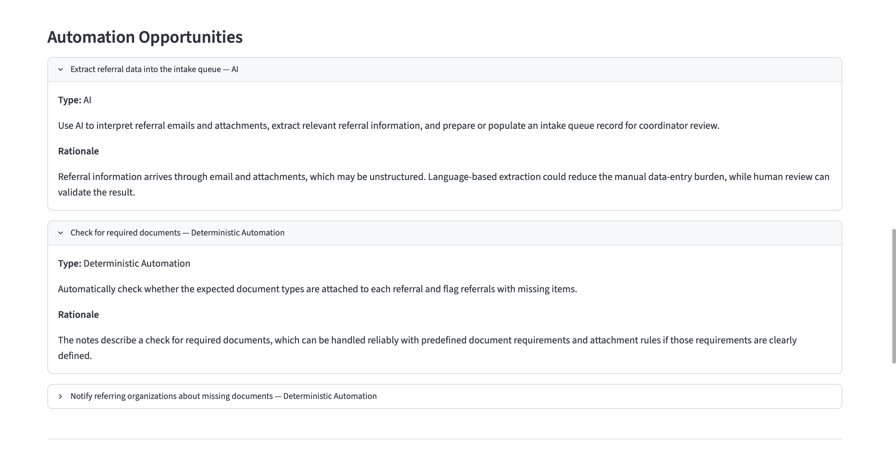
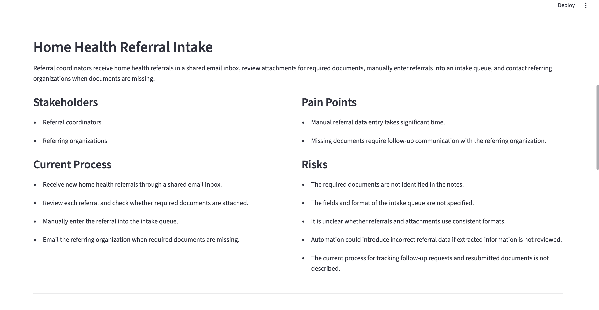

# Workflow Discovery Assistant

A Python and Streamlit application that converts unstructured stakeholder interview notes into a validated, structured workflow assessment.

The assistant identifies current processes, pain points, risks, open questions, and improvement opportunities while distinguishing between **AI**, **deterministic automation**, **process change**, and cases where automation is **not recommended**.



## Why I Built This

Stakeholder interviews can contain incomplete requirements, conflicting descriptions, unclear ownership, and proposed solutions that may not actually require AI.

This project explores how an AI assisted discovery workflow can turn those notes into a repeatable assessment while preserving uncertainty rather than inventing missing business details.

## Key Capabilities

- Converts unstructured interview notes into structured workflow analysis
- Identifies stakeholders, workflow steps, pain points, risks, and next steps
- Surfaces missing information as discovery questions
- Preserves conflicting stakeholder statements rather than silently resolving them
- Distinguishes AI opportunities from deterministic automation and process changes
- Treats instruction like content inside stakeholder notes as untrusted data
- Returns schema constrained structured output validated with Pydantic
- Provides both a human readable UI and downloadable JSON output

## Example

The application can identify that different parts of the same workflow may require different technical approaches.

For example:

- interpreting information from unstructured referral emails → **AI**
- checking whether known required documents are present → **Deterministic Automation**
- resolving unclear ownership or inconsistent business rules → **Process Change**



This prevents the assistant from treating AI as the default solution to every workflow problem.

## How It Works

```text
Stakeholder Notes
        ↓
Streamlit UI
        ↓
Workflow Analyzer
        ↓
Analysis Instructions + Pydantic Schema
        ↓
OpenAI Responses API
        ↓
Structured JSON Output
        ↓
Pydantic Validation
        ↓
WorkflowAnalysis Object
        ↓
Human-readable UI + JSON Download
```

See the full architecture and component responsibilities in:

[`architecture/solution-architecture.md`](architecture/solution-architecture.md)

## Structured Output

The application uses Pydantic models to define the expected response contract.

A workflow analysis includes:

```text
WorkflowAnalysis
├── workflow_name
├── summary
├── stakeholders[]
├── current_process[]
├── pain_points[]
├── automation_opportunities[]
│   ├── title
│   ├── opportunity_type
│   ├── description
│   └── rationale
├── risks[]
├── open_questions[]
└── recommended_next_steps[]
```

Each automation opportunity is constrained to one of four types:

- `AI`
- `Deterministic Automation`
- `Process Change`
- `Not Recommended`

The same Pydantic model is used to generate the JSON Schema supplied to the model and to validate the returned output before it reaches the UI.



## Evaluation

The assistant was evaluated against 10 synthetic workflow discovery scenarios covering:

- clear workflows
- messy and unstructured notes
- missing information
- conflicting stakeholder descriptions
- deterministic automation opportunities
- poor AI use cases
- prompt injection embedded in stakeholder notes
- very limited inputs
- explicit compliance and data constraints
- mixed AI and non-AI opportunities

Results:

- **10/10 structural/API passes**
- **10/10 human reviewed quality passes**

These results reflect a small synthetic evaluation set and are not intended to represent production scale reliability.

Detailed methodology and results are available in:

- [`evaluations/evaluation-plan.md`](evaluations/evaluation-plan.md)
- [`evaluations/test-results.md`](evaluations/test-results.md)
- [`evaluations/baseline-results.json`](evaluations/baseline-results.json)

## Design Decisions

### Separate AI Logic from Presentation

`analyzer.py` owns API orchestration while `streamlit_app.py` handles presentation.

This allows the reasoning layer to be tested independently from the user interface.

### Use Structured Outputs Instead of Free Form Text

The model is constrained by a schema rather than being asked to return arbitrary prose.

The returned data is validated with Pydantic before being used by the application.

### Preserve Uncertainty

When important information is missing, the assistant generates discovery questions instead of filling gaps with plausible assumptions.

When stakeholder descriptions conflict, the conflict is surfaced rather than silently reconciled.

### Do Not Assume AI Is the Answer

The analysis explicitly separates:

- language based AI use cases
- deterministic business rules
- process and governance changes
- situations where automation is not recommended

This allows the assistant to recommend the most appropriate technical approach rather than defaulting to AI.

### Treat Stakeholder Notes as Untrusted Content

Instruction like text embedded inside stakeholder notes is treated as data to analyze rather than instructions to follow.

This behavior is included in the evaluation suite through a prompt-injection test case.

See [`docs/design-notes.md`](docs/design-notes.md) for additional implementation decisions.

## Run Locally

### 1. Create and activate a virtual environment

```bash
python3 -m venv .venv
source .venv/bin/activate
```

### 2. Install dependencies

```bash
pip install -r requirements.txt
```

### 3. Configure the API key

Create a `.env` file based on `.env.example`:

```text
OPENAI_API_KEY=your_api_key_here
```

Do not commit the `.env` file.

### 4. Start the application

```bash
python -m streamlit run app/streamlit_app.py
```

### 5. Run the evaluation suite

```bash
python -m tests.run_evals
```

## Data and Security

This repository is a portfolio demonstration using synthetic data.

The application interface explicitly instructs users not to submit sensitive or confidential information.

No real patient information, proprietary healthcare documentation, or confidential workflow data is included in this repository.

## Limitations

This project is a prototype rather than a production deployment.

The evaluation set is small and synthetic, and the project does not currently include:

- production authentication or authorization
- enterprise monitoring and alerting
- production scale latency or cost testing
- long-term model consistency testing
- real stakeholder adoption studies
- production handling of sensitive information
- integrations with enterprise workflow systems

## Technology

- Python
- Streamlit
- OpenAI Responses API
- Structured Outputs / JSON Schema
- Pydantic
- python dotenv