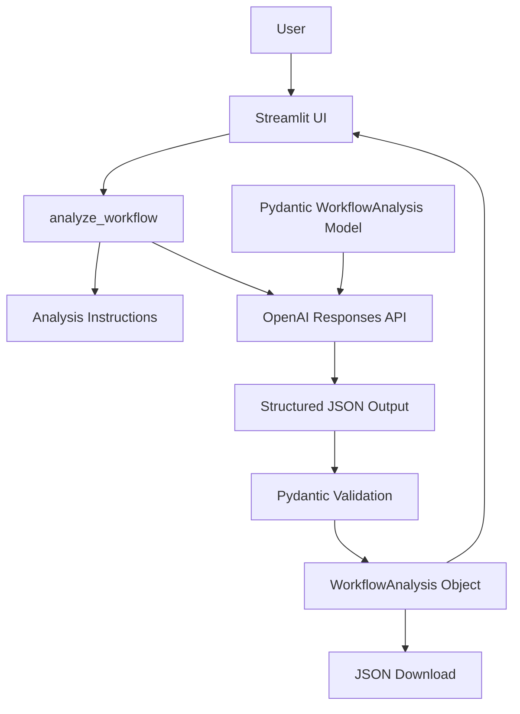

# Solution Architecture

## Architecture

## Overview

The Workflow Discovery Assistant converts unstructured stakeholder interview
notes into a validated, structured workflow assessment.

The application intentionally separates presentation, AI orchestration,
prompt instructions, and output validation.

## Components

### Streamlit UI

Provides the user interface for submitting stakeholder notes and viewing
the resulting workflow analysis.

### Analyzer

`app/analyzer.py` coordinates the OpenAI API request, loads the analysis
instructions, applies the structured-output schema, and validates the result.

### Analysis Instructions

`prompts/analysis-instructions.md` defines grounding, uncertainty handling,
prompt injection isolation, and solution selection behavior.

### Pydantic Models

`app/models.py` defines the application's structured data contract.

The schema distinguishes among:

- AI
- Deterministic Automation
- Process Change
- Not Recommended

### OpenAI Responses API

Processes the stakeholder notes using the supplied instructions and JSON schema.

### Validation

The generated JSON is parsed and validated as a `WorkflowAnalysis` object
before it is presented to the user.

### Output

The validated object is rendered as both:

- a human readable workflow assessment
- downloadable machine readable JSON